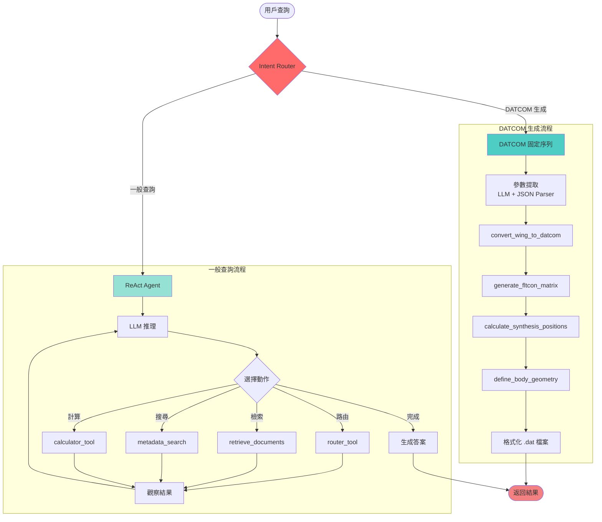
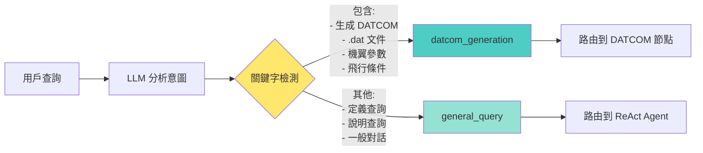
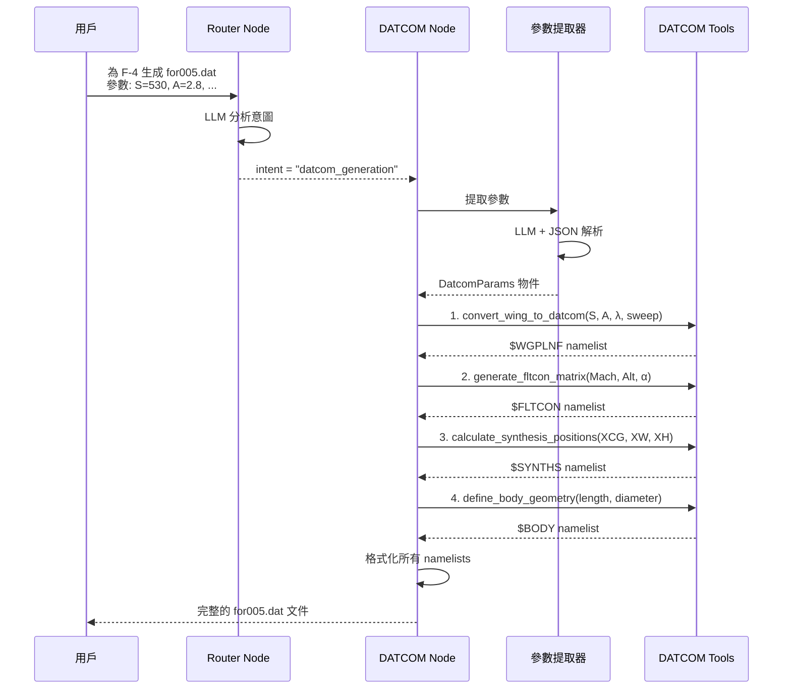

# UAV DATCOM RAG System

一個基於 **智能路由 + 固定序列** 混合架構的航空工程 RAG 系統,專門針對 **DATCOM 空氣動力學分析**和 **UAV 戰機設計**優化。系統使用 LangGraph 實現智能意圖路由,支援 DATCOM 文件自動生成和一般技術查詢。

[](https://www.python.org/)
[](https://github.com/langchain-ai/langgraph)
[](https://www.postgresql.org/)
[](https://github.com/pgvector/pgvector)

---

## 🚀 快速導航

- 📊 **[系統流程圖](#-系統流程圖)** - 視覺化架構概覽
- 📖 **[專案審查報告](docs/PROJECT_AUDIT.md)** - 完整的程式碼審查與品質評估
- 🗺️ **[發展路線圖](ROADMAP.md)** - v0.4 到 v1.0 的詳細計畫
- ⚡ **[快速開始](#-quick-start)** - 環境設定與安裝指南
- ✈️ **[DATCOM 使用指南](docs/DATCOM_USER_GUIDE.md)** - UAV 戰機設計應用說明

---

## 📊 系統流程圖

### 整體架構



### Intent Router 決策邏輯



### DATCOM 工具調用序列



---

## ✨ 核心特性

### 🎯 混合式路由架構 (v0.4)
- **智能意圖路由**：在 workflow 起點，`router_node` 會使用 LLM 判斷用戶意圖是「DATCOM 生成」還是一般查詢。
- **可靠的固定序列**：對於 DATCOM 生成任務，系統會執行 `datcom_node`，它以寫死的、可靠的順序調用所有必要的計算工具，徹底解決了先前 ReAct Agent 在長序列任務上的不穩定性。
- **靈活的 ReAct Agent**：對於所有其他一般性查詢，系統會路由到 `general_agent_node`，它使用 ReAct 模式來靈活地選擇檢索、計算或其他工具來回答問題。
- **關注點分離**：此架構將「特殊任務的可靠性」和「通用任務的靈活性」在架構層面完全分開，使系統更健壯、更易於維護和擴展。

### ✈️ DATCOM 專業能力
- **自動參數提取**：從自然語言描述中提取航空參數。
- **完整工具鏈**：
  - `convert_wing_to_datcom` - 機翼參數轉換
  - `generate_fltcon_matrix` - 飛行條件矩陣
  - `calculate_synthesis_positions` - 組件位置計算
  - `define_body_geometry` - 機身幾何定義
- **標準格式輸出**：生成符合 DATCOM 規範的 `.dat` 文件。

### 📚 文件處理能力
- **多格式支援**：DOCX、Markdown
- **智能切塊**：
  - 基於語義邊界切分（章節、段落）
  - 保留文件結構元數據
  - Chunk size: 500-1500 字元（可配置）
- **向量化儲存**：PostgreSQL + PGVector 高效語意搜尋

---

## 🏗️ 系統架構

### 核心模組

```
rag_system/
├── query_rag_pg.py          # CLI 入口點
├── agent.py                 # LangGraph workflow (路由 + 分支) ⭐
├── router_node.py           # Intent 路由節點 🆕
├── datcom_node.py           # DATCOM 固定序列節點 🆕
├── node.py                  # 通用 ReAct Agent 節點
├── state.py                 # GraphState 定義
└── tool/                    # 工具模組
    ├── datcom_calculator.py # DATCOM 計算工具
    ├── retrieve.py          # 向量檢索
    └── ...
```

### 模組職責

| 模組 | 職責 |
|:---|:---|
| `agent.py` | **Workflow 編排**：定義包含路由和條件分支的 LangGraph 圖。⭐ **(v0.4 核心)** |
| `router_node.py` | **意圖路由**：圖的入口點，判斷用戶查詢意圖。🆕 |
| `datcom_node.py` | **DATCOM 生成**：以固定順序執行 DATCOM 工具鏈，保證結果的可靠性。🆕 |
| `node.py` | **通用查詢**：處理所有非 DATCOM 的一般性 RAG 查詢。 |
| `query_rag_pg.py` | **CLI 入口**：解析命令列參數，建立並執行 Graph。 |
| `tool/` | Agent 可調用的各種工具（檢索、計算等）。 |
| `build/` | 文件解析、切塊、向量化、索引建立等離線處理工具。 |

---

## 🚀 Quick Start

### 1. 前置需求
- **Python**: 3.9 or newer.
- **Docker & Docker Compose**: For running the PostgreSQL database.

### 2. Environment & Dependencies

```bash
# 建立並啟用虛擬環境
python3 -m venv venv
source venv/bin/activate

# 安裝所有依賴
pip install -r requirements.txt
```

### 3. Application Configuration

```bash
# 從範本建立 .env 檔案
cp .env.example .env

# 編輯 .env 檔案並填入你的 API 金鑰
nano .env
```

### 4. Database Setup

```bash
# 在背景啟動 PostgreSQL 服務
docker compose up -d
```

---

## 📖 使用方式

### 案例 1：生成 DATCOM 文件 (v0.4 新流程)

系統會自動識別 DATCOM 生成請求並路由到 `datcom_node` 執行固定工具序列：

```bash
./query.sh "為 F-4 生成 for005.dat。參數: 機翼 S=530 ft², A=2.8, λ=0.3, 後掠角45°。飛行條件 Mach=0.8, 高度=10000 ft, 攻角=-2到10度步進2度, 重量=40000 lbs。機身長度=63 ft, 最大直徑=3 ft。位置 XCG=25 ft, XW=18.5 ft, XH=49 ft。" --debug
```

### 案例 2：一般技術查詢 (v0.4 新流程)

系統會將一般查詢路由到 `general_agent_node`，使用 ReAct 模式進行多輪推理和文件檢索：

```bash
./query.sh "什麼是 FLTCON namelist？它包含哪些參數？"
```

---

## 🔧 進階配置

### 自訂 System Prompt

若要修改通用 Agent 的行為，可編輯 `rag_system/node.py` 中的 `SYSTEM_PROMPT` 變數。

若要修改路由或 DATCOM 參數提取的行為，可分別編輯 `rag_system/router_node.py` 和 `rag_system/datcom_node.py` 中的提示詞。

---

## 🧪 測試與驗證

`subgraph.py` 中的 `if __name__ == "__main__":` 區塊提供了對新架構的單元測試，可分別測試通用查詢和 DATCOM 生成兩種路徑。

```bash
python -m rag_system.subgraph
```

---

**最後更新**：2025-10-07
