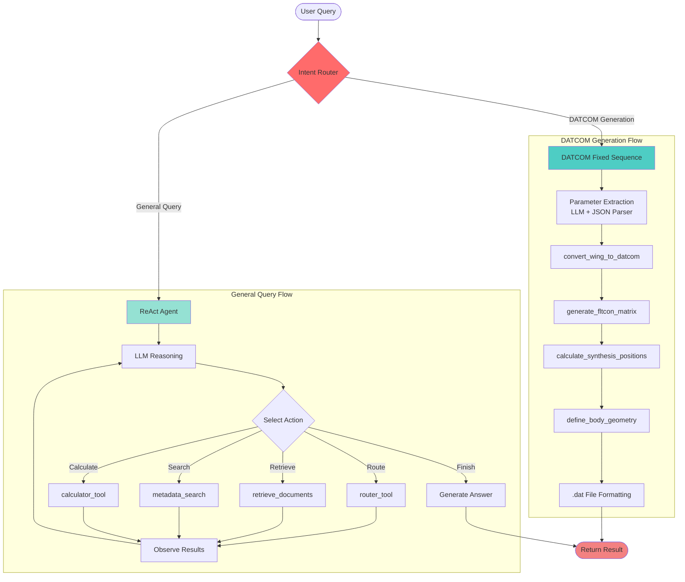
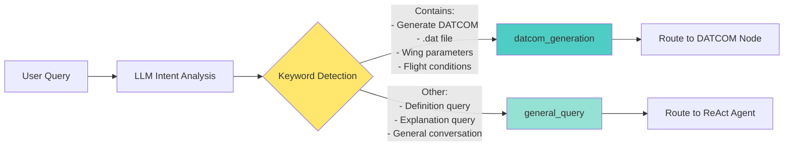

# Developer Guide

This guide provides a detailed overview of the RAG system's architecture, components, and development practices.

---

## 📊 System Architecture

The system uses a hybrid architecture that combines a fixed-sequence executor for specialized tasks (like DATCOM file generation) with a flexible ReAct agent for general-purpose queries. A router at the entry point directs the user's query to the appropriate workflow.

### Overall Architecture



### Intent Router Logic



---

## 📂 Project Structure

```
rag_system/
├── query_rag_pg.py          # CLI Entrypoint
├── agent.py                 # LangGraph workflow (routing + branches) ⭐
├── router_node.py           # Intent routing node 🆕
├── datcom_node.py           # DATCOM fixed-sequence node 🆕
├── node.py                  # General ReAct agent node
├── state.py                 # GraphState Definition
└── tool/                    # Tool modules
    ├── datcom_calculator.py # DATCOM calculation tools
    ├── retrieve.py          # Vector retrieval
    └── ...
├── build/                   # Indexing and document processing tools
    ├── indexer.py           # Main indexing script
    ├── document_parser.py   # File parsing (PDF, DOCX, etc.)
    ├── chunking.py          # Text splitting logic
    └── preprocess.py        # Text cleaning
```

### Module Responsibilities

| Module | Responsibility |
|:---|:---|
| `agent.py` | **Workflow Orchestration**: Defines the LangGraph graph with routing and conditional edges. | 
| `router_node.py` | **Intent Routing**: The entry point of the graph; determines the user's intent. | 
| `datcom_node.py` | **DATCOM Generation**: Executes the DATCOM toolchain in a fixed order for reliability. | 
| `node.py` | **General Query**: Handles all non-DATCOM general RAG queries using a ReAct loop. | 
| `query_rag_pg.py` | **CLI Entrypoint**: Parses command-line arguments and executes the graph. | 
| `tool/` | Contains all tools callable by the agent (retrieval, calculation, etc.). | 
| `build/` | Contains offline scripts for parsing, chunking, and indexing documents. | 

---

## 🔧 Building the Index (`build_all.sh`)

The `build_all.sh` script is the primary way to build and manage the vector database.

### Usage

- **Incremental Build (Default)**: Processes new documents and skips existing database collections.
  ```bash
  ./build_all.sh
  ```
- **Force Rebuild**: Deletes and rebuilds all collections from scratch. Use this if you change the chunking strategy or embedding model.
  ```bash
  ./build_all.sh --force
  ```
- **Rebuild Only**: Skips the document preprocessing step and rebuilds the index from existing Markdown files.
  ```bash
  ./build_all.sh --rebuild-only
  ```

### Data Flow

1.  **Input**: Documents in `rag_system/documents/`
2.  **Preprocess**: `preprocess.py` converts files to clean Markdown, output to `rag_system/processed_md/`.
3.  **Index**: `indexer.py` chunks the Markdown, generates embeddings, and stores them in the PostgreSQL database.

---

## 📦 Database Setup (PostgreSQL + PGVector)

The recommended setup uses Docker Compose.

### 1. Start the Database

```bash
# This command starts a PostgreSQL container named 'rag_db'
# listening on localhost:5433.
docker compose up -d
```

### 2. Verify

```bash
# Check that the container is running and healthy
docker compose ps

# Connect and verify the 'vector' extension is enabled
docker exec -it rag_db psql -U user -d rag_db -c "SELECT * FROM pg_extension WHERE extname = 'vector';"
```

### 3. Stop and Clean Up

```bash
# Stop the container but preserve data
docker compose stop

# Stop and remove the container (data volume is preserved)
docker compose down

# Stop, remove the container, AND delete all data
docker compose down -v
```

For manual installation instructions, refer to the official documentation for PostgreSQL and PGVector.

---

## 🔌 Subgraph Integration

The RAG system is designed to be a self-contained subgraph that can be integrated into a larger multi-agent system.

### Core Concept

The `create_rag_subgraph` function in `rag_system/subgraph.py` returns a compiled LangGraph object. The parent graph delegates tasks to this subgraph, which handles all internal logic and returns the final answer.

### Integration Steps

1.  **Import**: Import `create_rag_subgraph` and `RAGConfig`.
    ```python
    from rag_system.subgraph import create_rag_subgraph
    from rag_system.config import RAGConfig
    ```

2.  **Initialize**: Create the RAG configuration and the subgraph node.
    ```python
    llm = ChatOpenAI(model="your-model")
    rag_config = RAGConfig.from_env()
    rag_node = create_rag_subgraph(llm, rag_config, name="rag_expert")
    ```

3.  **Add to Graph**: Add the `rag_node` to your supervisor graph.
    ```python
    supervisor_graph.add_node("rag_expert", rag_node)
    ```

4.  **Route**: Create conditional edges in your supervisor to route tasks to the `rag_expert` node.
    ```python
    supervisor_graph.add_conditional_edges(
        "router_node",
        lambda state: "rag_expert" if should_delegate(state) else "other_tool",
        {"rag_expert": "rag_expert", "other_tool": "other_tool_node"}
    )
    supervisor_graph.add_edge("rag_expert", "supervisor_evaluator_node")
    ```

### Data Flow

-   **Input**: The user's question should be the last message in the `messages` list of the graph state.
-   **Output**: The subgraph's answer is placed in the `generation` field of the state.

---
**Last Updated**: 2025-10-08
